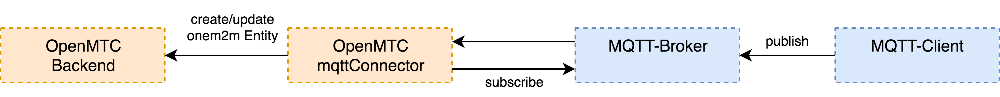
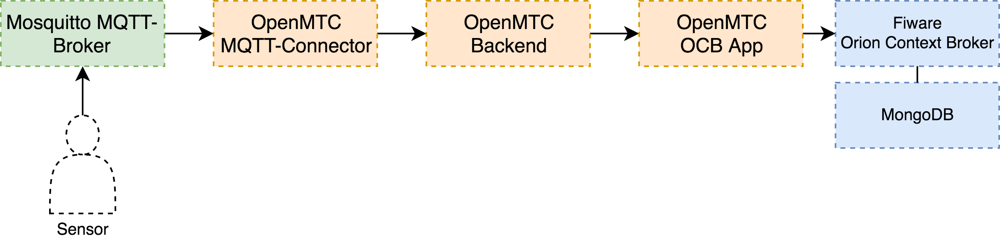

# Introduction


MQTTConnector is able to connect a MQTT-Broker with OpenMTC. The subscribes to specific topics on the broker in order to forward all published data to OpenMTC.

The MQTTConnector will subscribe itself on the MQTT-Broker (e.g. MeshBlu) to a specific first topics level. Published data is expected to contain at least two more topic levels, with one representing the location and one the device. This information will later be used to create an entity within the OpenMTC resource tree. If data is published, the MQTTConnector app will be notified via the subscription and will forward the data to an instance of OpenMTC (gateway or backend).

# Getting started

In order to get an overview of the possible paramters of the app:

```
./apps/mqtt-connector -v
```

The most relevant paramters are the following:

EP (Endpoint): URL of the OpenMTC endpoint to use (backend or gateway)
Example: "http://localhost:18000"

BROKER_EP (MQTT Endpoint): URL of the MQTT-Broker
Example: "http://localhost:1883"

TOPIC_PRE: definition of the first topic level in order to filter for relevant topics
Example: "OfficeBuilding"

TOPIC_INDEX_LOCATION: topic level representing the location
Example: 1

TOPIC_INDEX_DEVICE: topic level representing the device
Example: 2

BROKER_USER: username to connect to the MQTT Broker
BROKER_USER_PW: password to connect to the MQTT Broker

If used to together with the OpenMTC OrionContextBroker app, it is also possible to configure a specific fiware service.

# Required Data Format

In order to work data needs to be published to the MQTT-Broker in an onem2m specific format. This will look like the following:

```json
{
    "m2m:cin": {
        "con": B64_ENCODED_SENML_PAYLOAD
    }
}
```

where the B64_ENCODED_SENML_PAYLOAD could look like this:

decoded:
```json
[
    {
        "bn": "23",
        "v": 27,
        "u": "Celsius",
        "t": 1527757260000,
        "n": "Temperatur"
    }
]
```

# Example



In this example setup, we are using the MQTTConnector to forward data of a temperature sensor connected to the Mosquitto MQTT-Broker via OpenMTC to an instance of the Fiware Orion Context Broker. The following docker-compose configuration shows the setup in more detail.

```
version: "2"

services:
    backend:
        image: openmtc/backend-amd64
        ports:
            - "18000:18000"
        environment:
            - ONEM2M_NOTIFICATION_DISABLED=false
            - ONEM2M_HTTP_TRANSPORT_DISABLED=false
            - ONEM2M_HTTP_TRANSPORT_SSL_ENABLED=false
            - ONEM2M_HTTP_TRANSPORT_REQUIRE_CERT=false

    mosquitto:
        image: eclipse-mosquitto
        ports:
            - "1883:1883"

    mqtt-ipe:
        image: openmtc/mqttconnector-amd64
        environment:
            - EP=http://backend:18000
            - BROKER_EP=mosquitto:1883
            - TOPIC_PRE=OfficeBuilding
            - TOPIC_INDEX_LOCATION=1
            - TOPIC_INDEX_DEVICE=2
        links:
            - mosquitto
            - backend

    orioncontextbroker-app:
        image: openmtc/orion-context-broker-app-amd64
        container_name: orioncontextbroker-app
        links:
            - backend
            - orion
        ports:
            - "8086:8086"
            - "8080:8080"
        environment:
            - EP=http://backend:18000
            - ORION_HOST=http://orion:1026
            - ORION_API=v2
            - ACCUMULATE_ADDRESS=http://orioncontextbroker-app:8080
            - LABELS=["openmtc:sensor_data"]

    mongo:
        image: mongo:3.4
        command: --nojournal

    orion:
        image: fiware/orion
        ports:
            - "1026:1026"
        command: -dbhost mongo -logLevel debug
        links:
            - mongo
```

The following will be published to topic OfficeBuilding/MeetingRoom/temperature:

```json
{
    "m2m:cin": {
        "con": "W3tibjogMjMsIHY6IDI3LCB1OiBDZWxzaXVzLCB0OiAxNTI3NzU3MjYwMDAwLCBuOiBUZW1wZXJhdHVyfV0K"
    }
}
```

The string is in "con" is the base64 representation of:

```json
[
    {
        "bn": "23",
        "v": 27,
        "u": "Celsius",
        "t": 1527757260000,
        "n": "temperature"
    }
]
```

If the data is successfully published to the MQTT-Broker it will be forwarded to the OCB. Therefore we are able to request the data from the OCB.

```
curl localhost:1026/v2/entities/MeetingRoom-temperature/attrs -H -s
```

```json
{
  "temperature": {
    "type": "Float",
    "value": 27,
    "metadata": {
      "bn": {
        "type": "String",
        "value": 23
      },
      "timestamp": {
        "type": "String",
        "value": 152775726000
      },
      "unit": {
        "type": "String",
        "value": "Celsius"
      }
    }
  }
}

```
