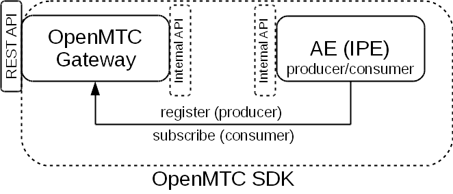
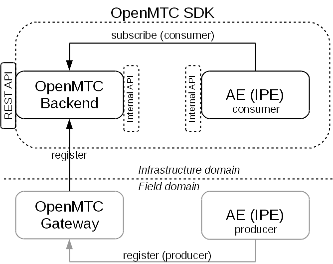

# OpenMTC Deployment 

## How to initialize OpenMTC for development?

This step-by-step tutorial assumes you have [Ubuntu](https://en.wikipedia.org/wiki/Ubuntu_%28operating_system%29)
-- or any other [Debian](https://en.wikipedia.org/wiki/Debian)-based Linux distribution -- installed.  Particularly, this guide works best with Ubuntu 16.04, Ubuntu 14.04 or Debian Jessie.   
  
Your OpenMTC development setup may be based on running OpenMTC
components  with:
* [Docker](https://www.docker.com/) 
  (recommended)
* purely based on Python  

## How to setup a development environment using Docker?

*Note:* If you do not have a running docker setup, we provide a [docker installation
guide](./various.md). Alternativly you can use the [offical docker
documentation](https://docs.docker.com/engine/installation/linux/docker-ce/ubuntu/).

For this scenario, be sure to build Docker container images for following OpenMTC components:

* sdk
* gateway
* backend

## Building Docker container images for OpenMTC components

For the following, it is expected that the OpenMTC code repository is
prepared in a directory named:

```
OpenMTC
```

OpenMTC container images will be created through a hiearchy of
dependent images.  For example when creating image 'sdk', a dependent
'base' image will be created.  After completing the build process for
each Docker image, the image is to be found in the machine's local
Docker repository. 

**Be sure to have installed Docker.io in version 1.6.2 at minimum.**

```
cd OpenMTC
./create-binary-docker sdk
./create-binary-docker gateway
```

This will create Docker image for the machine's architecture and store
them in the local Docker repository.  These freshly generated Docker
images will have names dependent on your architecture.

## Crossbuilding OpenMTC Docker container images

Similarly to the last subsection, it is possible to crossbuild, for
example, Docker images for ARM on an AMD64 machine.  Therefore, an
additional parameter needs to be provided to the
`create-binary-docker` script.

```
cd OpenMTC
./create-binary-docker --arch arm sdk
./create-binary-docker --arch arm gateway
```

Again, all freshly generated images are stored in the machine's local
Docker repository.  Note that these images will hold "/arm" in their
names.

It is possible to export these newly created Docker images and make
them available to the target machine, by import.

For a description on how to `save` newly created Docker
images, see:
[How to save crossbuild Docker images](#how-to-save-crossbuild-docker-images).

For a description on how to `load` a saved Docker image, on the target
machine, see:
[How to load saved Docker images](#how-to-load-saved-docker-images).


## How to inspect freshly generated Docker images

TODO

## How to save crossbuild Docker images

**Disclaimer:** *Docker provides commands like export/import and
save/load.  Sadly, it is easy to get confused here.  The command
`save` is used to export a Docker image, while the command `load` is
used to import this Docker image.  Whereas, the coammds export/import
are to container instances.*

Assuming that the Docker images for OpenMTC Gateway and Backend are
named as `openmtc/gateway-arm` and `openmtc/backend-arm`, it is
possible to store these two images in one file, by using the
following:
 
``` shell
# Assuming this to be executed on the crossbuild host machine

# Additionally assuming, you have enough file space in /tmp available
cd /tmp

docker save -o openmtc-docker-images.tar openmtc/gateway-arm  openmtc/backend-arm
```
 
## How to load saved Docker images

 After you have copied the tar file that stores the above mentioned
 Docker images to the destination machine, use the following command
 to load them into the local Docker repository of the destination
 machine.
 
``` shell
# Assuming this to be executed on the crossbuild target machine

# Additionally assuming, the tarfile was copied to /tmp directory
cd /tmp

docker load -i openmtc-docker-images.tar
```

### OpenMTC development setup, for field domain only

The following figure describes a simple OpenMTC development setup.
All data entities within a oneM2M system are represented as
*resources*.  All resources are hierarchical ordered within the
*resource tree*.  For this simple OpenMTC development setup, it is
assumed that all resources from the Application Entity (AE) will be
accessible via the OpenMTC Gateway. This means that the whole setup
is placed in field domain only. Via the external REST API, a user
is able to adjust the resource tree by using an HTTP client.

 
 
In the figure above, it is also shown that a developer will use the
OpenMTC SDK to provides her own Application Entity (AE).  This
user-defined application entity is able to access functionality of
the OpenMTC Gateway by using the SDK's internal API.

A developer that wants to develop an AE may use this simplified
development setup.  Therefore, the developer will need to run an
OpenMTC Gateway.  This can be achieved easily by using the prepare
Docker images: 
  
```shell
docker run -d --name gateway  -p 0.0.0.0:8000:8000  -e "EXTERNAL_IP=<EXTERNAL_IP>"  \
    -e "LOGGING_LEVEL=DEBUG"    openmtc/gateway-arm -vv
```


- If you need to make the OpenMTC Gateway accessible to outside of
  your host machine, use `<EXTERNAL_IP>` to configure this.
- Note that the Docker image name `openmtc/gateway-arm` may vary on
  your machine.  Use `docker images` to identify the Docker image name
  you need to use here.
- If you need to know more about detail of `-d` (detach) and the port
  mapping configuration `-p 0.0.0.0:8000:8000`, check out the
  [documenation as provided by Docker](https://docs.docker.com/engine/reference/run/).

 If you already want to start with OpenMTC development, jump  to
 [How to test your development setup?](#how-to-test-your-development-setup).

### OpenMTC development setup, for infrastructure domain

 The following figure depicts a more complex setup of OpenMTC.  Here,
 the focus on AE development for infrastructure domain.  The following
 figure depicts this setup.

 
 
 Here, the simple setup from the last subsection is extended.  An AE
 in the field domain acts as a producer of data.  Within this example,
 another AE is developed that acts as data consumer in the
 infrastructure domain.  Therefore, an OpenMTC Backend will be used by
 the AE in infrastructure domain, to subscribe to the data from the
 field domain.
 
 For this setup the developer will need to provide,

1. An OpenMTC Backend
 ```
 docker run -ti --name backend -p 0.0.0.0:18000:18000 -e "ONEM2M_CSE_ID=<CSE_ID>" \
  -e "ONEM2M_NOTIFICATION_DISABLED=false" openmtc/backend-arm -v
 ```
 - `<CSE_ID>` : The `CSE_ID` of the Backend (e.g. `backend`) 
1. An OpenMTC Gateway (note that this configuration is different to
   the one from the last example, due to the connection to the OpenMTC
   Backend)
 ```
 docker run -d --name gateway -p 0.0.0.0:8000:8000 -e "EXTERNAL_IP=<EXTERNAL_IP>" \
    -e "ONEM2M_HTTP_TRANSPORT_PORT=8000"    -e "ONEM2M_CSE_ID=<CSE_ID>" \
    -e "ONEM2M_REMOTE_CSE_POA=<POA>"        -e "ONEM2M_REMOTE_CSE_ID=<REMOTE_CSE_ID>"  \
    -e "ONEM2M_NOTIFICATION_DISABLED=false" -e "ONEM2M_REGISTRATION_DISABLED=false" \	
    openmtc/gateway-arm -v
 ```
 - IP configuration: `<EXTERNAL_IP>`
 - `<CSE_ID>` : The `CSE_ID` of the Gateway (e.g. `gateway`)
 - `<REMOTE_CSE_ID>` : The `CSE_ID` of the Backend (e.g. `backend`)
 - `<POA>` : An URL that describes the POA fo Backend (e.g. "http://localhost:18000")
 - If you need to know more about detail of `-d` (detach) and the port
   mapping configuration `-p 0.0.0.0:8000:8000`, check out the
  [documenation as provided by Docker](https://docs.docker.com/engine/reference/run/).

