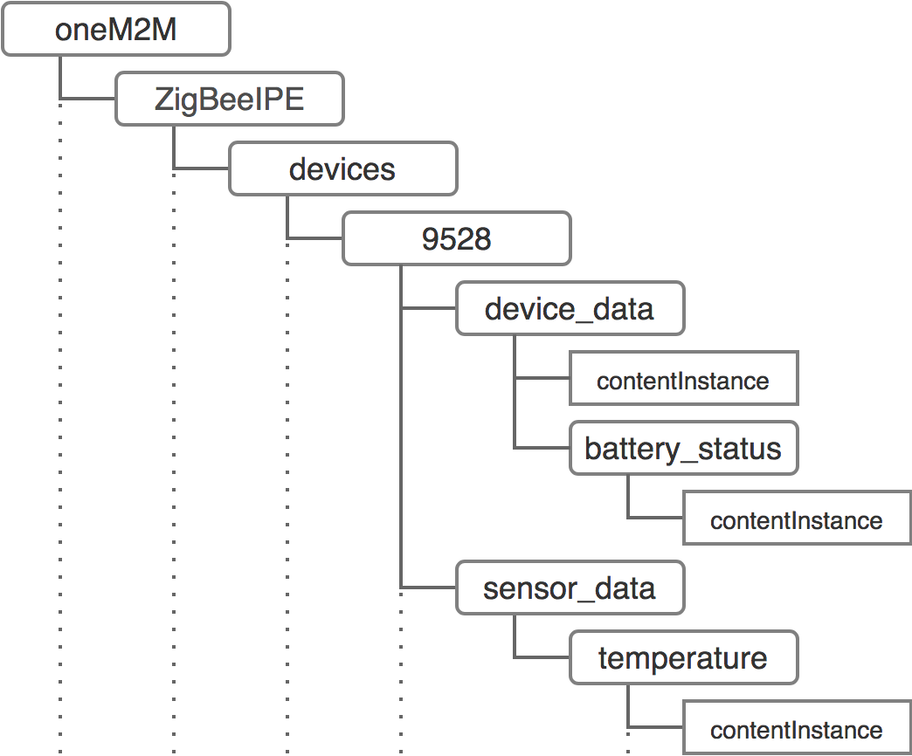

# Introduction to OpenMTC

## Using OpenMTC for IoT/M2M applications

OpenMTC provides an implementation of the [oneM2M standard](http://www.onem2m.org/).
This allows you to develop new or test existing IoT/M2M applications, create
your own IoT/M2M infrastructure, or extend an existing one.

## How is data represented in an OpenMTC-based system?

In an OpenMTC system, all entities are represented as **resources**. Resources
are either:

* **Containers** consisting of other containers (subcontainer) or content instances 
* **Content Instances** holding actual values
  
This results in a hierarchical **resource tree** with content instances as leafs.
Each resource within the resource tree is uniquely addressable by an unique identifier (URI).

### Example

Lets assume you have a ZigBee device providing informations about the current
temperature and its battery status. This will result in the following resource
tree:

## How to access and provide data from/to an OpenMTC-based system?

OpenMTC provides mechanisms to create, change, update, and delete
resources in the resource tree.  Therefore, an application is needed
that will use one of the following two approaches:

* **A REST API** (external interface)
* **The OpenMTC SDK** (internal interface)
  
Using the *REST API*, it is possible to provide your application logic
by just using your preferred HTTP client.  
  
In addition, it is also possible to use the *OpenMTC SDK* to write your application. Common
problems, like how to create a subscription that will notify your
application whenever a particular resources are changed or have a new
content instance available, are easily to be solved, using the SDK.
 
## How to structure your OpenMTC-based IoT system?

Using OpenMTC, it is possible to create your own IoT/M2M infrastructure.
Consider an IoT system that collects data from different sensors, in
different field domains, and automatically distributes the data to
central nodes of multiple field domains.  

With OpenMTC you would setup an **OpenMTC Gateway** for every field domain. All
oneM2M devices within this field domain would register themself with the
gateway. Non-oneM2M devices would need an **Interworking Proxy** 
inbetween to translate to oneM2M.  
The gateways are registered at an **OpenMTC Backend** within the infrastructure domain.  
**OpenMTC Applications** could either connect directly to the gateways or the backend to provide/collect data. 

### Application (AE)
   
An application is provided by you and others to access data within the OpenMTC-based IoT system.
  
An example for an application is the server part of Graphical User Interface (GUI), that allows to
visualize data stored in the resource tree.  
Another example would be an application using device data to do some analytics
and providing the results within the resource tree.

#### Interworking Proxy (IPE)

A special kind of application -- in a matter of speaking -- is an IPE.
An IPE allows to translate data from a non-oneM2M domain to a oneM2M
domain.
  
An example for an IPE could be an application that reads out sensor
values from your sensor device by using a vendor-specific binary
interface and translates it to oneM2M.

 
### OpenMTC Gateway
 
A software node that is central to a particular small field domain
that allows to collect data from various IPEs.  A local application
can access the resource tree, via the OpenMTC Gateway.

It is possible to create a hierarchy of OpenMTC Gateways.  This
allows to travel data from one part in your IoT system to another
one.
  
### OpenMTC Backend

If you need a central software node within the infrastructure domain,
the OpenMTC Backend is the exact choice.  Usually, it acts as the
root node within a hierarchy of OpenMTC Gateways.
