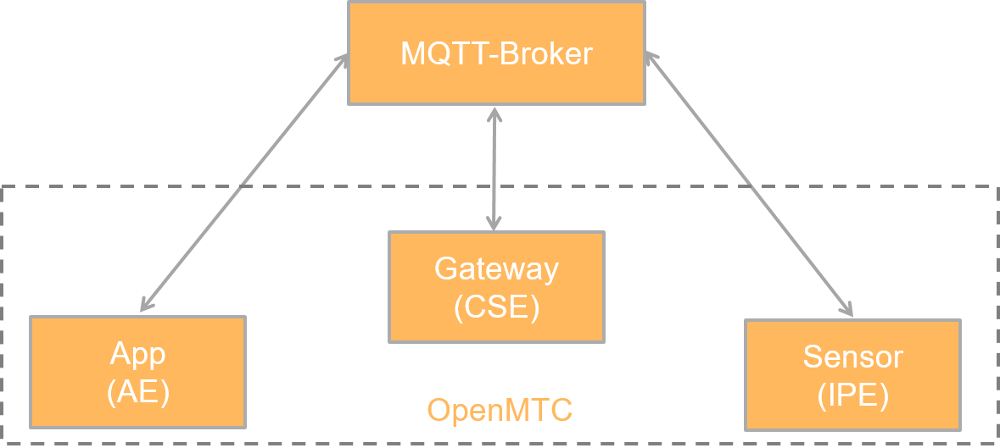

# The oneM2M MQTT Client
In addition to the [oneM2M HTTP Client](./sdk-client.md), the OpenMTC application framework features an MQTT client. 

## About MQTT
MQTT is short for “Message Queue Telemetry Transport,” a protocol that has originally been developed by IBM as a means of transportation for data in sensor networks. In contrast to HTTP, MQTT does not work in a request-response-manor; a publish-subscribe-approach is being embraced instead.

For the protocol to work, an intermediary called “Broker” is required: Its role is to accept messages from connected clients and relay them among existing subscriptions. Through this centralised structure, communication through MQTT will always require at least one additional peer in comparison to other protocols supported by the framework.

Setting up a broker is imperative, but due to the wealth of available solutions well outside the scope of this document. Exhaustive testing has been conducted against [Moquette](http://andsel.github.io/moquette/), which allows interoperability to be pretty much guaranteed for version 0.8+. For a quick start (or testing), you may use an openly available [public broker](https://github.com/mqtt/mqtt.github.io/wiki/public_brokers) such as `iot.eclipse.org`. It goes without saying that message confidentiality on public infrastructure is nil. Hence, those brokers do not present an option in production environments. Doing so is hereby strongly discouraged.

In the event of a reduced-complexity, low-maintenance set-up being desired, using a [docker image](https://hub.docker.com/search/?isAutomated=0&isOfficial=0&page=1&pullCount=0&q=mqtt+broker&starCount=0) were recommended over a public broker. There is no absolute requirement on docker, though.      



## Working With The MQTT Client
The `OneM2MMQTTClient` class implements protocol binding in accordance to [TS-0010](http://www.onem2m.org/images/files/deliverables/Release2/TS-0010-MQTT%20Protocol%20Binding-V2_4_1.pdf "oneM2M Technical Specification 0010 v2.4.1 – MQTT Protocol Binding") akin to `OneM2MHTTPClient`. The two classes have been designed to work interchangeably from an application standpoint; differences in behaviours should be strictly related to the respective underlying transport protocols.

Actual low-level MQTT handling is performed by the [paho mqtt library](http://www.eclipse.org/paho/clients/python/). Users are encouraged to open issues with that project in case of pure MQTT havoc. 

### Establishing Connectivity
Although the interfaces of both, `OneM2MHTTPClient` and `OneM2MMQTTClient` are identical, addressing endpoints varies drastically. Through the necessity of a broker commonly reachable by two peers, said broker has to be the endpoint instead of the peer's machines. Subsequently, an address suitable for `OneM2MMQTTClient` can in general not be crafted by merely substituting `http://` with `mqtt://`. (A notable exception is a set-up in which all peers - including the broker - are located on one and the same machine.)

For a simple set-up of one AE and one CSE, proceed as follows:

##### Broker

Either you use an external broker like `iot.eclipse.org` (see [link](https://iot.eclipse.org/getting-started.html#sandboxes) for information) or you can set up a local one.

An example for a docker-based broker can be found [here](https://github.com/renarj/moquette-spring-docker). Just start it with the following command (assumes docker is already installed):

```bash
$ docker run -d -p 1883:1883 renarj/mqtt:latest
```

The following example assumes you have a local broker. Otherwise exchange `localhost` with `iot.eclipse.org`.

#### Gateway (MN-CSE)
1. Locate the `config-gateway.json` configuration file
1. Find the `plugins`.`openmtc_cse`.`MQTTTransportPlugin` entry
1. Change `disabled` to `false`:

```json
{
  "name": "MQTTTransportPlugin",
  "package": "openmtc_cse.plugins.transport_gevent_mqtt",
  "disabled": false,
  "config": {
    "interface": "localhost",
    "port": 1883
  }
},
  ```

> **_Hint:_** A gateway is not locked in a single protocol. Multiple transport plugins can be active at the same time, allowing for a CSE to be reachable through a set of protocols.


> **⚠️ Warning:** For the sake of brevity, `localhost` is set as broker. Please consider the introduction on MQTT regarding the ramifications.

4. Start the gateway through the `run-gateway` script

On a related note, enabling the plugin in the backend (IN-CSE) is done in an almost identical way: Just read `config-backend.json` in step 1 and `run-backend` in step 4.

To have the gateway registered to the backend via MQTT you have to change the Registration Plugin. Here the `poa` and `own_poa` entries like the following example:

```json
{
    "name": "RegistrationHandler",
    "package": "openmtc_cse.plugins.registration_handler",
    "disabled": false,
    "config": {
        "labels": [
            "openmtc"
        ],
        "remote_cses": [
            {
                "cse_id": "in-cse-1",
                "poa": [
                    "mqtt://localhost:1883"
                ],
                "own_poa": [
                    "mqtt://localhost:1883"
                ],
                "cse_base": "onem2m",
                "cse_type": "IN_CSE"
            }
        ],
        "interval": 3600,
        "offset": 3600
    }
},
```

#### Application Entity
Programmatically, it is sufficient to create an instance of `OneM2MMQTTClient` with a given endpoint. In adoption of [example 8a](./training/onem2m-examples/onem2m-example-8a.py):
```python
from openmtc_onem2m.client.mqtt import OneM2MMQTTClient

client = OneM2MMQTTClient("mqtt://localhost#mn-cse-1")
```

All subsequent examples should be modifiable in the same fashion in order to enable MQTT support. In general, adjusting endpoints and providing the proper client is concluding the required steps.

Please note the particle of the endpoint's URL being the name of a CSE. Due to the addressing scheme in oneM2M/MQTT, a requesting entity has to know the responding entities name in advance. It should be duly noted that this is a workaround neither mandated nor sanctioned by TS-0010. In fact, the semantics of particles in MQTT-URLs are [entirely undefined](https://github.com/mqtt/mqtt.github.io/wiki/URI-Scheme). This inconvenience may or may not vanish in future releases.

#### Using Training Applications
Also the existing training applications can be re-used which can be found under [doc/training/apps/onem2m](./training/apps/onem2m). The four applications which end with `-final.py` can be changed in order to use the starting script under [doc/training/start-app.sh](./training/start-app.sh).

One example would be `onem2m-gui-sensors-final.py`. Change the last few lines from

```python
host = 'http://localhost:18000'
app = TestGUI(
    poas=['http://localhost:21345'],          # adds poas in order to receive notifications
    # SSL options
    originator_pre='//openmtc.org/in-cse-1',  # originator_pre, needs to match value in cert
    ca_certs='../../openmtc-gevent/certs/ca-chain.cert.pem',
    cert_file='certs/test-gui.cert.pem',      # cert file, pre-shipped and should match name
    key_file='certs/test-gui.key.pem'
)
Runner(app).run(host)
```

to

```python
host = 'mqtt://localhost:1883#in-cse-1'
app = TestGUI(
    poas=['mqtt://localhost:1883'],          # adds poas in order to receive notifications
    # SSL options
    originator_pre='//openmtc.org/in-cse-1',  # originator_pre, needs to match value in cert
    ca_certs='../../openmtc-gevent/certs/ca-chain.cert.pem',
    cert_file='certs/test-gui.cert.pem',      # cert file, pre-shipped and should match name
    key_file='certs/test-gui.key.pem'
)
Runner(app).run(host)
```

The change in `host` makes the AE to communicate with the backend (IN-CSE) via the broker. The change in `poas` lets notifications handled by the broker as well.

## Further Reading
 - [Official MQTT Website](http://mqtt.org/)
 - [MQTT on Wikipedia](https://en.wikipedia.org/wiki/MQTT)
